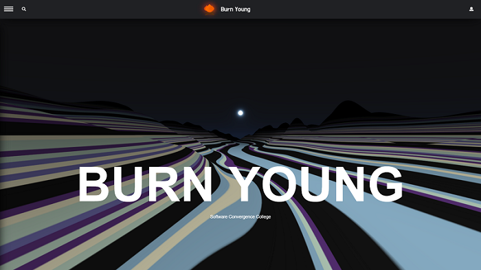
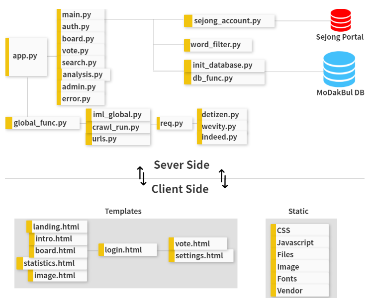

# Modakbul

>  소프트웨어융합대학 제 3대 학생회 "번영"에서 주최하는 학술제 및  "웹으로 소융대를 설명하라" 공모전을 위해 개발된 프로젝트입니다.

## Award

**2019 Sejong Software Convergence Contest 1st**
(2019 세종대학교 소프트웨어융합대학 웹소셜 공모전대회 대상)

## Document

- https://bonfire-2.gitbook.io/modakbul/

## Project Stack

- Windows 10 / Ubuntu(AWS)
- Python 3 - Flask & extended module - Requests - BeautifulSoup - Mysqldb

#### Client

- HTML & CSS - Bootstrap

- Javascript - JQuery

#### Server

- Flask

- SQL - (MySQL 5.7.25)

- uwsgi + nginx
